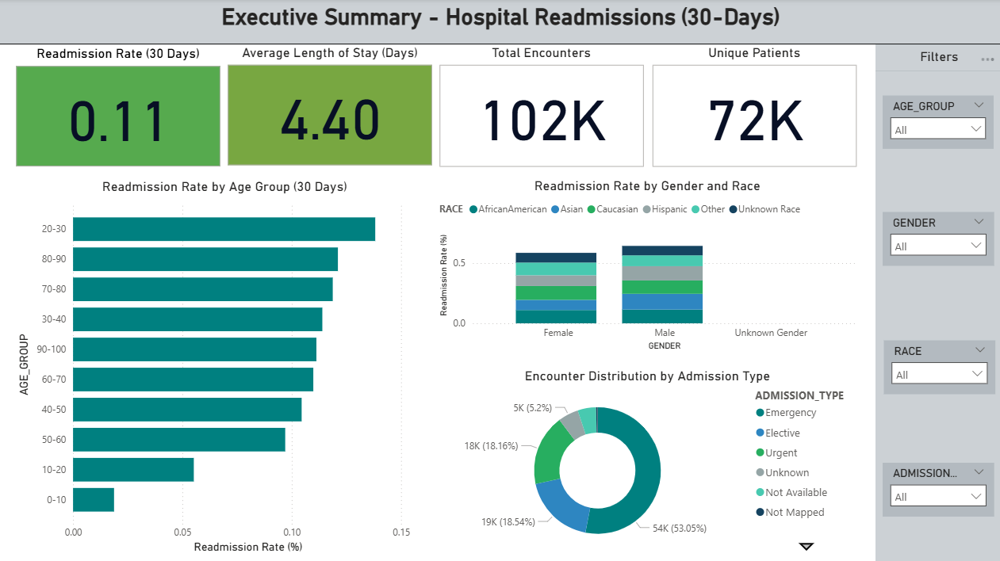

# Hospital Readmission Analytics & Prediction using Snowflake and Machine Learning

  

## 📄 Overview
Hospital readmissions are a major concern for healthcare providers and payers. Early identification of patients at high risk of readmission can help optimize care, reduce costs, and improve outcomes.  

This project implements a **full end-to-end analytics and predictive modeling pipeline** leveraging **Snowflake for data warehousing**, **dbt for data modeling**, **Airflow for orchestration**, and **Machine Learning models** for readmission prediction. The pipeline is complemented by **Power BI dashboards** for executive insights and decision-making.

---

## 🧰 Technologies Used
- **Data & ETL:** Snowflake, SQL, dbt, Airflow  
- **Languages:** Python, SQL  
- **Libraries & Tools:** Pandas, NumPy, scikit-learn, XGBoost, LightGBM, CatBoost, EBM, SHAP  
- **Visualization & BI:** Power BI  
- **Project Management:** Jupyter Notebook, Git  

---

## 🗂️ Dataset
- **Source:** [Kaggle Diabetes Hospital Readmission Dataset](https://www.kaggle.com/datasets/guest123/diabetes-readmission)  
- **Description:** 101,766 hospital encounters, 72,000 unique patients, 50 columns including demographics, diagnoses, medications, and hospital admission/discharge details.  
- **Target Variable:** `readmitted_flag` (1 = readmitted <30 days, 0 = otherwise)  
- **Goal:** Predict 30-day hospital readmissions using patient and hospitalization features.

---

## 🚀 Workflow
1. **Data Exploration & Cleaning:**  
   - Handled missing values, unknown categories, outliers, and inconsistent formats.  
   - Standardized labs, medications, and demographic attributes.  

2. **Snowflake Data Pipeline Setup:**  
   - Created **RAW, STAGING, ANALYTICS** schemas.  
   - Loaded incremental CSVs using SnowSQL `PUT + COPY INTO`.  
   - Audit logging to track row counts, load time, and validation.  

3. **dbt Modeling:**  
   - Built **dimensional models**: `dim_patients`, `dim_diagnosis`, `dim_admission`, `dim_discharge`, `dim_medical_specialty`, `dim_payer`.  
   - Fact tables: `fact_visits`, `fact_medications`.  
   - Implemented **tests** for uniqueness, nulls, and accepted values.  

4. **Orchestration with Airflow:**  
   - Automated daily ingestion, staging, dbt runs, and audit updates.  
   - DAG ensures end-to-end pipeline reliability and incremental data growth.  

5. **EDA & Feature Engineering:**  
   - Explored demographics, diagnoses, medications, admission types, and readmission trends.  
   - Created derived features: age groups, admission/discharge categories, top diagnoses.  

6. **Predictive Modeling:**  
   - Baseline models: Logistic Regression, Random Forest, XGBoost.  
   - Addressed class imbalance using class weighting, SMOTE, and threshold tuning.  
   - Feature selection and hyperparameter tuning optimized predictive performance.  

7. **Explainability & Insights:**  
   - **SHAP** and **EBM** provided global and local interpretability.  
   - Key predictors: discharge disposition, age group, diagnosis categories, labs, and number of medications.  

8. **BI Dashboard (Power BI):**  
   - KPIs: Readmission rate, average length of stay, patient volume, demographic breakdowns.  
   - Filters: Age group, gender, race, admission type.  
   - Unknown categories surfaced for data quality transparency.  

---

## 📊 Key Results
| Model            | ROC-AUC | Precision | Recall | F1-Score |
|-----------------|---------|-----------|--------|----------|
| XGBoost (tuned) | 0.687   | 0.18      | 0.57   | 0.27     |
| LightGBM         | 0.680   | 0.17      | 0.56   | 0.26     |
| CatBoost         | 0.685   | 0.18      | 0.55   | 0.27     |
| EBM              | 0.670   | 0.16      | 0.54   | 0.25     |
| Logistic Reg.    | 0.620   | 0.18      | 0.57   | 0.27     |

**Insights:**  
- XGBoost provided the best predictive performance with balanced recall and interpretability.  
- Discharge disposition, age group, diagnosis, labs, and medications were the most influential predictors.  
- Class imbalance handled via weighting improved detection of at-risk patients.  

---

## 📌 Key Takeaways
- End-to-end pipelines with Snowflake, dbt, and Airflow ensure robust, repeatable analytics.  
- Machine learning models combined with explainability tools enable actionable insights for clinicians.  
- Data quality transparency (Unknowns, missing values) builds trust in dashboards and decision-making.  
